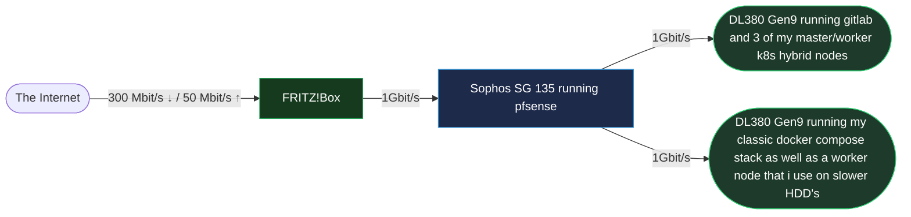
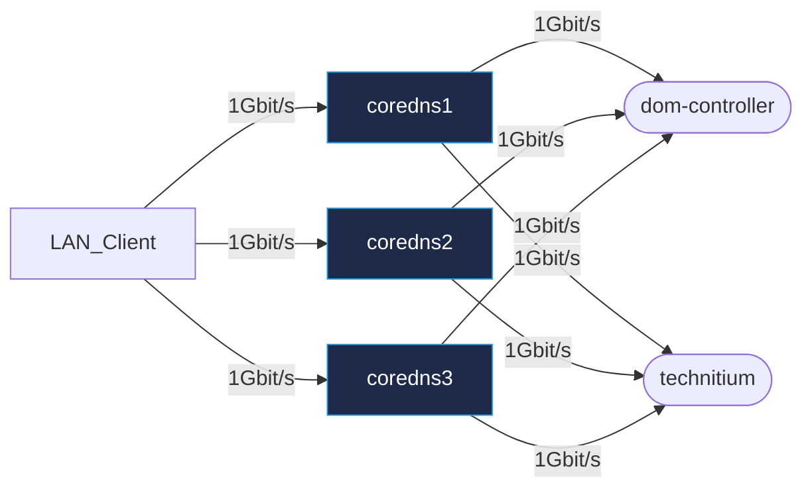
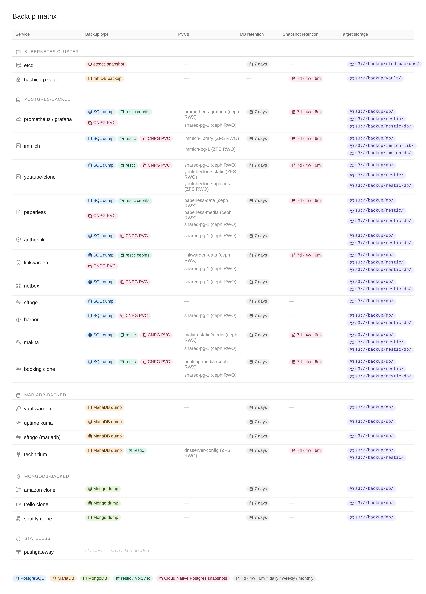

<div align="center">


## Kubernetes Operations 🦊

[](https://discord.gg/home-operations)&nbsp;&nbsp;
[](https://kromgo.thekor.eu/fedora_version)&nbsp;&nbsp;
[](https://kromgo.thekor.eu/kubernetes_version)&nbsp;&nbsp;
[](https://uptime.thekor.eu/status/up)&nbsp;&nbsp;

[](https://kromgo.thekor.eu/cluster_age)&nbsp;&nbsp;&nbsp;
[](https://kromgo.thekor.eu/node_uptime)&nbsp;&nbsp;&nbsp;
[](https://kromgo.thekor.eu/unhealthy_services)&nbsp;&nbsp;&nbsp;
[](https://kromgo.thekor.eu/node_count)&nbsp;&nbsp;&nbsp;
[](https://kromgo.thekor.eu/pod_count)&nbsp;&nbsp;&nbsp;
[](https://kromgo.thekor.eu/cluster_cpu_usage)&nbsp;&nbsp;&nbsp;
[](https://kromgo.thekor.eu/cluster_memory_usage)&nbsp;&nbsp;&nbsp;
[](https://kromgo.thekor.eu/ilo_power_current_watt)


</div>

### What is this repo?

This is the repository I use to version control the kubernetes cluster I deploy and maintain at home & at work. I currently use [terraform](https://developer.hashicorp.com/terraform), [fedora core OS](https://fedoraproject.org/coreos/) and [kubespray](https://github.com/kubernetes-sigs/kubespray) to provide a secure, lightweight, reproducible and immutable environment so that I can avoid drift and force everyone to have everything run in containers. I have a total of [4 virtual machines](https://github.com/hupratt/kubespray/blob/homelab/inventory/homelab-prod/inventory.ini) in my homelab, 3 of which are master/worker hybrids and the 4th one is a worker node running on my slower HDD's to host applications that don't need low latency. 

### Core Components

<details>
  <summary>Click to see the components</summary>

- **Networking**: [cilium](https://github.com/cilium/cilium) provides eBPF-based (kernel-based) networking replacing kube-proxy, [haproxy](https://www.haproxy.com/) is the cluster's ingress and [harbor](https://goharbor.io/) works as a cluster-local proxy-cache (egress) and scan for vulnerabilities. [Containerd is configured here to use a fallback mirror in case harbor is unavailable](https://github.com/hupratt/kubespray/blob/homelab/inventory/homelab-prod/group_vars/all/offline.yml)
- **HTTPS**: [cert-manager](https://github.com/cert-manager/cert-manager) is in charge of TLS certificates and i have [DNS acme challenge with hetzner](https://github.com/hetzner/cert-manager-webhook-hetzner/blob/main/docs/guides/quickstart.md) in order to issue and update my wildcard certificate. Gitlab and ansible read the secrets from a local [ansible-vault](https://docs.ansible.com/projects/ansible/latest/cli/ansible-vault.html) for continuous delivery. And i use a handy helper function to soft link the secret in the cert-manager namespace to other namespaces.
- **Storage & Data Protection**: [rook](https://github.com/rook/rook) provides distributed block storage with Ceph. I have an hourly bash script that does an pull-based sql dump of all databases and stores it in an S3 storage hosted at hetzner on an ext4 luks encrypted partition. CephFS and RBD volumes are backed up once a week and stored in the same S3 storage as well.
- **Single source of truth**: I don't apply patches at the yaml level or edit helm charts on the fly so having this repo be my single source of truth for my infrastructure as code makes my installs as reproducible as I can. Other popular projects like Flux or ArgoCD can do this as well but I'm already configuring my infrastructure with ansible and it [has extensive support for kubernetes](https://galaxy.ansible.com) via its community hub so I decided to stick to it. As long as you make sure to create a process that your team can understand, that's what matters. Whether you achieve eventual consistency through control loops or with imperative playbooks, with helm charts, no helm charts, git, svn, k8s operators or manual configs it's all the same in the end.
- **Compliance**: I have [kyverno policies here](https://github.com/hupratt/kubespray/blob/homelab/homelab_playbooks/00-kyverno.yaml) enforcing a number of ClusterAdmissionPolicies such as disallowing privileged containers, requiring resource limits, requiring health probes, blocking latest image tags in production namespaces, blocking containers from running with root privileges and blocking containers from running with SYS_ADMIN and NET_ADMIN permissions so that malicious containers can't impact the host kernel or host network stack.
- **CI/CD Continuous integration & deployment**: I'm managing the continuous integration and continuous deployment with [a self hosted gitlab instance](https://gitlab.thekor.eu/docker/chirpy/-/blob/master/.gitlab-ci.yml?ref_type=heads) at the project level. The docker build command builds the artifacts and the ```kubectl rollout``` command deploys it and waits for the health checks to be up before replacing the container. I'm self hosting my helm repo in gitlab as a git repository but i'm planning to have an oci repository with [harbor](https://goharbor.io/) soon. Another improvement in the roadmap is to have oauth2 integration between hashicorp's vault and gitlab so that I don't need to share passwords and kubeconfig files as parameters in my gitlab runner's jobs.

### Directory Helper

This repository uses the following layout. As a high level overview, the network/VM side is managed by terraform in the infrastructure folder, the inventory then defines the targets and configuration for kubespray to bootstrap our cluster and the homelab_playbooks install the software I need on the pods.


```sh
📁 infrastructure
├── 📁 fcos-hetzner # fedora core OS VPS provisioning on hetzner
│   ├── 📝 main.tf
│   ├── 📝 terraform.tfvars.example
│   ├── 📝 generate-butane-and-ign.sh
│   ├── 📝 upload-fcos-to-hetzner.sh
│   ├── 📝 upload-fcos-to-hetzner-hcloud.sh
│   └── 📝 run.sh
├── 📁 fcos-proxmox-homelab # fedora core OS VM provisioning with the proxmox provider
│   ├── 📝 main.tf
│   ├── 📝 outputs.tf
│   ├── 📝 variables.tf
│   ├── 📝 terraform.tfvars.example
│   ├── 📝 generate-butane-and-ign.sh
│   ├── 📝 run.sh
└── 📁 talos-hetzner # talos VPS provisioning on hetzner
    ├── 📝 install.md
    ├── 📝 main.tf
    ├── 📝 network.tf
    ├── 📝 outputs.tf
    ├── 📝 servers.tf
    ├── 📝 talos.tf
    ├── 📝 terraform.tfvars.example
    └── 📝 variables.tf
📁 inventory # kubespray's ansible inventory configuration
├── 📁 mycluster # configuration used to bootstrap my cluster
│   ├── 📁 group_vars
│   │   ├── 📁 all # customize ansible's behavior e.g. don't use dnf installs
│   │   ├── 📝 etcd.yml
│   │   └── 📁 k8s_cluster
│   │       ├── 📝 k8s-cluster.yml
│   │       ├── 📝 k8s-net-cilium.yml
│   │       └── 📝 kube_control_plane.yml
│   └── 📝 inventory.ini
📁 homelab_playbooks # my playbooks
├── 📝 00-XX.yaml # ansible playbook that installs service XX on k8s
├── 📁 charts # local helm charts
├── 📁 files  # basic yaml files
├── 📁 group_vars # variables and secrets
├── 📁 env # python environment where you install the requirements
├── 📝 requirements.txt
├── 📝 requirements.yml
📁 work_playbooks # work playbooks
├── 📝 00-XX.yaml # ansible playbook that installs service XX on k8s
├── 📁 charts # local helm charts
├── 📁 files  # basic yaml files
├── 📁 group_vars # variables and secrets
├── 📁 env # python environment where you install the requirements
├── 📝 requirements.txt
└── 📝 requirements.yml

```
---
</details>

### What I'm running in the cluster

<details>
  <summary>Click to see the applications deployed in this repo</summary>

### 1. Infrastructure

| | Application | Description |
|---|---|---|
|  | **Cilium** | eBPF-based CNI — networking, load balancing, network policies, and TLS secret management |
|  | **Rook-Ceph** | Distributed storage: block (RBD), filesystem (CephFS), object (S3-compatible) |
|  | **cert-manager** | Automatic TLS provisioning via ACME |
| 🔀 | **HAProxy Ingress** | Ingress controller with TLS termination and external traffic routing |
|  | **Grafana** | Metrics dashboards and alerting via Prometheus |
|  | **Harbor** | Container registry — image storage, signing, Trivy scanning, OCI/Helm support, mirror cache |
| 💾 | **Backup** | CronJobs pushing DB dumps, RBD snapshots, and CephFS archives to S3 |
|  | **Mosquitto** | MQTT broker bridging Frigate and Home Assistant for detection events and snapshots |
|  | **Patchmon** | Patch management and ansible inventory for all my playbooks |
|  | **HashiCorp Vault** | Secrets management — API keys, DB creds, dynamic secrets, transit encryption, policy-based access |
|  | **External Secrets Operator** | Syncs Vault secrets into native Kubernetes Secrets, kept up to date automatically |
|  | **Technitium** | recursive resolver and an authoritative DNS server that I'm using as a conditional forwarder for my domain |
|  | **Volsync** | Orchestrate snapshots to use restic and back my data into an s3 storage. It ships with a CSI of its own and has the right node affinity rules to avoid the "multi-attach error" once you try to mount the source pods that you get when doing cronjobs. Volsync allows us to drastically reduce our RTO  |


### 2. Identity & Security

| | Application | Description |
|---|---|---|
|  | **Authentik** | SSO via OIDC / OAuth2 / LDAP with MFA and AD sync |
|  | **Vaultwarden** | Self-hosted password manager with browser and mobile sync |
|  | **Kyverno** | Admission controller — no privileged/root containers, required resource limits, no `latest` tags, blocked dangerous capabilities |

### 3. Databases

| | Application | Description |
|---|---|---|
|  | **PostgreSQL** | 2 CNPG clusters. One for immich and the another shared cluster for Authentik, NetBox, PostHog, Django apps, Grafana, Harbor, linkwarden, paperless-ngx and patchmon |
|  | **MariaDB** | MySQL-compatible DB managed with a kubernetes operator |
|  | **MongoDB** | Document store for Node.js apps and the Amazon clone |

### 4. Productivity & Tools

| | Application | Description |
|---|---|---|
|  | **Immich** | Self-hosted Google Photos replacement with ML-powered face recognition, object tagging, and map view. Backs up photos from mobile in the background over wifi |
|  | **Paperless-ngx** | OCR document management with tagging and full-text search |
|  | **Linkwarden** | Bookmark manager with full-page archiving |
|  | **Trello Clone** | Kanban board with cards, labels, and due dates |
| 🌐 | **Chirpy** | Self-hosted microblogging platform |
| 🌐 | **Youtube-clone** | Self-hosted video platform |
|  | **SFTPGo** | SFTP / FTP / WebDAV server with S3 backend support |
| 🌐 | **NetBox** | CMDB + IPAM + rack modeling |
|  | **PostHog** | Product analytics and event tracking |
|  | **Spotify Collector** | Listening analytics dashboard |
| 🌐 | **Kromgo** | [Small kubernetes deployment](https://github.com/kashalls/kromgo) that exposes a json api with prometheus metrics like cpu usage or kubernetes version for example |
| 🌐 | **Replicator** | [Helm project](https://github.com/mittwald/kubernetes-replicator) that watches for changes in secrets and syncs in case the source changes |
|  | **Matrix** | [Messaging service](https://github.com/element-hq/synapse) that i use to bridge discord, signal and whatsapp communication |
|  | **Neolink** | [Converts the proprietary Reolink stream into rtsp](https://github.com/thirtythreeforty/neolink) so that frigate, and by extension home assistant, can process the video feed |
| 🌐 | **ilo exporter** | [Rest api](https://github.com/MauveSoftware/ilo_exporter) that acts as a middleware between prometheus and HPE's out-of-band management controller (iLO) |

### 5. AI Powered

| | Application | Description |
|---|---|---|
| 🌐 | **Open WebUI** | Frontend for Ollama / OpenAI APIs with RAG and chat |
|  | **Frigate** | NVR with real-time object detection |
|  | **Scriberr** | Voice transcription service powered by OpenAI Whisper running locally. Accepts audio uploads or real-time mic input and returns structured transcripts |
|  | **Immich** | Self-hosted photo management with ML tagging |

### 6. My Projects

| | Application | Description |
|---|---|---|
|  | **Booking Clone** | Django-based reservation system |
|  | **Amazon Clone** | React + Django e-commerce app with MongoDB |
|  | **Thrifty** | Budget tracker with charts and summaries |
|  | **Makita** | Travel diary with S3-backed image storage |
|  | **Portfolio** | Static personal website |
|  | **HLS Streaming** | Live streaming via FFmpeg + HLS |
|  | **Backup PNG** | Small utility tool where i can document my backup jobs |


### Critical dependencies

My most important bits are arguably storage (rook and zfs), DNS and the ingress routing rules. Hashicorp vault and gitlab are arguably come in close second place because I didn't migrate all of my secrets to the vault yet and because I managed to get harbor as a backup proxy registry so if gitlab should fail I can rely on harbor. I'm doing dual NAT so that the mistakes only impact my playground and reduce the blast radius significantly. 

---
</details>


### Networking

<details>
  <summary>Click to expand network architecture</summary>

#### Overview of my home network


#### Ingress for kubernetes

i have multiple containerized haproxies that 1) do raw tcp proxying, 2) append TLS certificates and 3) update the configuration through the dataplane api so that I don't get disruptions on other routes. The raw tcp proxying is an absolute must for me since I'm doing TLS termination on the kubernetes cluster and TLS termination on a secondary haproxy for my legacy docker stack. 



#### Networks & Vlans

I went a bit overboard with the number of vlans but I wanted to test out all possible combinations because of the flexibility it allows. I can have a device on the basement and the office on the same network without requiring them to be physically connected to the same switch

| Name                | VLAN | Description                                                                                                  |
|---------------------|------|--------------------------------------------------------------------------------------------------------------|
| Management          | 1    | Trunk port is the default on netgear devices. This VLAN is part of all VLANs                                 |
| IPMI                | 3    | This is the out of band management tool on all servers which of course has no business going to the internet |
| Backups             | 4    | This is the network for the backup servers                                                                   |
| IOT                 | 5    | raspberry pi, home assistant and zigbee/wifi devices                                                         |
| Server Net          | 6    | Both HP servers share this VLAN                                                                              |
| Printers            | 7    | self explanatory                                                                                             |
| Media Net           | 8    | For devices that need to communicate with jellyfin                                                           |
| Guest network       | 99   | I didn't have to define this one on my firewall as my router creates this special VLAN                       |

#### DNS

I'm doing split-horizon DNS meaning I have two networks. The first one for my homelab and the second for my family in order to avoid any disturbance. LAN clients on the homelab's network resolve to the pfsense gateway and other devices go straight to the internet.

LAN clients on the homelab's network have a series of coredns that act like caches for my technitium server and 2 other coredns instances running on the production k8s cluster but those are not exposed outside of the cluster. Everything that belongs to *.dc.mydomain.com get directed to the windows domain controller and everything else hits the technitium who acts as a recursive DNS resolver. I switched from pihole to technitium because it supports recursion without having to side-car an unbound server, it's cloud native, has more features and allows changes through the rest api. 



#### Cloud Dependencies

While most of my infrastructure and workloads are self-hosted I do rely upon the cloud for certain key parts of my setup. This saves me from dealing with services I critically need for my cluster:

| Service                     | Use                                                                                                  | Cost              |
|-----------------------------|------------------------------------------------------------------------------------------------------|-------------------|
| Hetzner                     | DNS, 2 x x86 VMs with ipv4 addresses, remote backups                                                 | ~€180/yr          |
| Godaddy                     | Domains registrar                                                                                    | ~€12/yr           |
| Let's Encrypt               | Issuing TLS Certificates                                                                             | Free              |
| Github actions              | [Status page](https://github.com/hupratt/upptime) to report on the health of my services             | Free              |
| Spotify family              | Podcast & music to keep afloat                                                                       | €21.99/month      |
|                             |                                                                                                      | Total: ~€49/month |

---
</details>


### Backup Architecture

<details>
  <summary>Click to expand backup strategy</summary>


#### Backup Flows

3-2-1 strategy. I have 3 copies of my data: the one in production, the one on my proxmox backup server and a remote copy on a cloud server. 

| Flow             | Tool               | Destinations                                                                                 | Schedule          |
|------------------|--------------------|----------------------------------------------------------------------------------------------|-------------------|
| Postgres statefulset      | custom bash script | sql dump stored in an external S3 storage       | hourly            |
| Mongodb statefulset       | custom bash script | tar dump stored in an external S3 storage       | hourly            |
| Mariadb statefulset       | custom bash script | sql dump stored in an external S3 storage       | hourly            |
| etcd       | custom bash script | *.db stored in an S3 storage       | hourly            |
| Database and filesystems | volsync and restic | PVCs get snapshoted and the incrementals get stored on an external S3 storage | hourly |
| Proxmox backup server | proxmox integration | Block devices get snapshoted, split into chunks and encrypted locally | once a week |
| Proxmox replication | first proxmox backup server gets replicated to the second proxmox backup server | Sync | once a week |


#### Backup strategy per service

All backups are sent to the cloud based offsite VPS to an S3 storage hosted at hetzner on an ext4 luks encrypted partition




---
</details>


### Hardware

<details>
  <summary>Click to see the hardware</summary>

When deciding to move into distributed storage system like ceph or longhorn it's important to use fast and modern hardware. The hardware I'm using is at the very least 10 years old so I had to make some tweaks (larger bluestore cache and disabling compression) to make it work but as a rule of thumb I'd get at least a 6gbit/s consumer SSD to get started. Those can sustain a couple of users writing to it occasionally. If you're on a budget I would also stay away from 10/25/100 Gbit networking as you probably don't have a use case for it and is not as easy to setup as you might think. You're much better off investing into a hyper converged setup and invest into a good enough platform that won't be bottlenecked by your cpu or your storage.

A Xeon v3 for instance is slow for this use case and is not even optimized to do those crc32 checksums which ceph does for every block so you'll occasionnaly hit a bottleneck as well even when using those 6bit/s consumer ssds. Datacenter SSDs on the other hand don't rely on that SLC cache thing and can endure sustained reads and writes without losing performance but they come at a hefty price.

If I ever want to get fewer kubeapi errors due to my storage latency (long fsyncs) I'll probably have to invest into a small nvme drive so that i can use it as a cache and offload the data that I use the most.


<details>
  <summary>Click to see the rack</summary>
  Updated 17/09/2024

  

| Device                    | Count | OS Disk Size | Data Disk Size                               | Ram           | Operating System | Purpose                           |
|---------------------------|-------|--------------|----------------------------------------------|---------------|------------------|-----------------------------------|
| 1U Sophos SG 135          | 1     | -            | 100Gb SSD                                    | -             | pfsense          | Router, DHCP, DHCP relay and PXE  |
| 2U HP Proliant DL380 Gen9 | 1     | -            | 3x240Gb (Samsung PM883) + 3x2Tb VM passthrough for ceph storage      | 64 Gb DDR4    | debian           | k8s Worker/CP prod                |
| 2U Dell PowerEdge R720    | 1     | -            | 4x2Tb VM passthrough                         | 64 Gb DDR3    | proxmox VE       | k8s Worker/CP staging             |
| 2U Fujitsu RX2540 M2 R6   | 1     | -            |                                              | 96 Gb DDR3    | debian           |                                   |
| 2U HP Proliant DL380 G7   | 1     | -            |                                              |               | debian           |                                   |
| Sophos UTM 220            | 1     | -            |                                              |               |                  | 2 x L2 Netgear switches           |
| 1U Cisco catalyst switch  | 1     | -            |                                              |               |                  |                                   |
| 2U Dell PowerEdge R510    | 1     | -            |                                              | 32 Gb DDR3    | debian           | main backup server                |
| 2U HP Proliant DL380 Gen9 | 1     | -            | 7x600Gb (raidz1) + 1 500Gb raid0             | 64 Gb DDR4    | debian           | Docker compose stack + k8s Worker             |
| 2U Dell PowerEdge R510    | 1     | -            |                                              | 32 Gb DDR3    | debian           | secondary backup server           |
| 1U QLogic 8Gbit/s         | 1     | -            |                                              |               |                  |                                   |


---
</details>
</details>


## Inspiration

Thanks to [waifulabs](https://github.com/waifulabs/infrastructure) for sharing this template